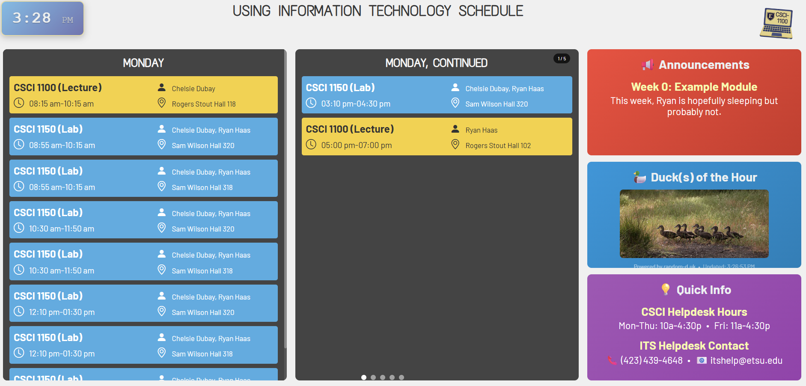

# University Schedule Kiosk Display

A Flask-based web application that displays university course schedules, lab sessions, and announcements in a 16:9 kiosk format. Perfect for displaying in hallways, computer labs, or department offices.

<p align="center">
    
</p>

## Features

- **Dynamic Schedule Display**: Shows lecture and lab schedules organized by day of the week
- **Smart Pagination**: Automatically creates slides to handle busy days with many events
- **Time-based Announcements**: Displays relevant announcements based on current date
- **Responsive Design**: Clean, readable interface suitable for kiosk displays
- **Multiple View Modes**: Both paginated and simple view options
- **Raspberry Pi Ready**: Automated installation script for dedicated kiosk deployment

## Quick Start

### For Development/Testing

#### Prerequisites

- Python 3.7 or higher
- pip (Python package installer)

#### Installation

1. **Clone or download the project files** to your desired directory:
   ```bash
   cd /path/to/your/project
   ```

2. **Create a virtual environment**:
   ```bash
   python -m venv .venv
   ```

3. **Activate the virtual environment**:
   - **Windows**:
     ```bash
     .venv\Scripts\activate
     ```
   - **macOS/Linux**:
     ```bash
     source .venv/bin/activate
     ```

4. **Install required dependencies**:
   ```bash
   pip install flask flask-cors
   ```

5. **Create the data directory and CSV files** (see Data Setup section below)

6. **Run the application**:
   ```bash
   python app.py
   ```

7. **Access the kiosk display**:
   - Main display (paginated): http://localhost:5000
   - Simple display: http://localhost:5000/simple

### For Raspberry Pi Kiosk Deployment

For a more detailed setup guide, see [Raspberry Pi Kiosk Display Setup Guide](./raspberry_pi_kiosk_setup.md)

For a complete, production-ready kiosk setup on Raspberry Pi that automatically starts on boot:

1. **Transfer your project files** to your Raspberry Pi

2. **Make the installation script executable**:
   ```bash
   chmod +x install_kiosk.sh
   ```

3. **Run the automated installation script**:
   ```bash
   ./install_kiosk.sh
   ```

4. **Follow the prompts** to complete the installation

5. **Add your CSV data files** to `/opt/kiosk-display/data/`

6. **Reboot** to see the kiosk display start automatically:
   ```bash
   sudo reboot
   ```

The installation script will:
- Install all required system packages and dependencies
- Set up the Flask application as a systemd service
- Configure Chromium to launch automatically in fullscreen kiosk mode
- Optimize the system for kiosk display usage
- Create backup and uninstall scripts for easy maintenance

#### HDMI Display Issues?

If your Raspberry Pi doesn't output to HDMI properly (especially with KVM switches, splitters, or some monitors), add this line to `/boot/config.txt`:

```bash
sudo nano /boot/config.txt
```

Add:
```ini
hdmi_force_hotplug=1
```

Then reboot. This forces HDMI output even when no display is detected at boot time.

## Project Structure

```
your-project/
├── app.py                     # Main Flask application
├── install_kiosk.sh          # Automated Raspberry Pi installation script
├── data/                      # Data directory
│   ├── lecture_schedule.csv   # Lecture schedule data
│   ├── lab_schedule.csv       # Lab schedule data
│   └── announcements.csv      # Announcements data
├── static/                    # Static files
│   └── styles.css             # Global style rules
├── templates/                 # HTML templates (not included in provided code)
│   ├── schedule.html          # Main paginated schedule template
└── .venv/                     # Virtual environment (created during setup)
```

## Data Setup

Create a `data/` directory in your project root and add the following CSV files:

### 1. announcements.csv

Controls what announcements are displayed based on date ranges.

**Format:**
```csv
StartDate,EndDate,Title,Announcement
08/25,08/31,Week 1: Module Name,"This week we will introduce the course and begin our first module..."
09/01,09/07,Week 2: Module Name,"This week we continue with..."
```

**Fields:**
- `StartDate`: Start date in MM/DD format
- `EndDate`: End date in MM/DD format  
- `Title`: Announcement title
- `Announcement`: Full announcement text (use quotes if contains commas)

### 2. lecture_schedule.csv

Contains regular lecture schedules.

**Format:**
```csv
Subj,Crse,Sec,Title,Days,Time,Instructor,Location
CSCI,1100,1,Using Info Tech Lecture,M,08:15 am-10:15 am,"Chelsie Dubay, Ryan Haas",Rogers Stout Hall 118
CSCI,1100,2,Using Info Tech Lecture,TWR,10:30 am-11:50 am,"John Smith",Rogers Stout Hall 102
```

**Fields:**
- `Subj`: Subject code (e.g., CSCI)
- `Crse`: Course number (e.g., 1100)
- `Sec`: Section number
- `Title`: Course title
- `Days`: Days of week (M=Monday, T=Tuesday, W=Wednesday, R=Thursday, F=Friday, S=Saturday, Su=Sunday)
- `Time`: Time range in 12-hour format
- `Instructor`: Instructor name(s)
- `Location`: Classroom location

### 3. lab_schedule.csv

Contains lab schedules with date ranges.

**Format:**
```csv
Subj,Crse,Sec,Title,Days,Time,Instructor,Date (MM/DD),Location
CSCI,1150,001,Using Information Tech Lab,M,08:55 am-10:15 am,"Chelsie Dubay, Ryan Haas",08/25-12/11,Sam Wilson Hall 320
```

**Fields:**
- Same as lecture_schedule.csv, plus:
- `Date (MM/DD)`: Date range when lab is active (MM/DD-MM/DD format)

## Usage

### Development Mode

1. **Activate your virtual environment** (if not already activated):
   ```bash
   # Windows
   .venv\Scripts\activate
   
   # macOS/Linux
   source .venv/bin/activate
   ```

2. **Start the Flask application**:
   ```bash
   python app.py
   ```

3. **Access the application**:
   - Main kiosk display: http://localhost:5000
   - Simple view: http://localhost:5000/simple

### Production Kiosk Mode (Raspberry Pi)

After running the installation script:

- **Check service status**: `sudo systemctl status kiosk-display`
- **View logs**: `sudo journalctl -u kiosk-display -f`
- **Restart service**: `sudo systemctl restart kiosk-display`
- **Update data**: Copy new CSV files to `/opt/kiosk-display/data/`

### Display Features

- **Automatic Pagination**: Days with many events are automatically split across slides
- **Time-based Announcements**: Only shows announcements that are currently active
- **Smart Grouping**: Events are grouped by day and sorted by start time
- **Special Handling**: "Using Info Tech" courses are automatically renamed to CSCI 1100/1150

### Deployment Options

#### For Production Deployment (Non-Kiosk)

1. **Use a production WSGI server** like Gunicorn:
   ```bash
   pip install gunicorn
   gunicorn -w 4 -b 0.0.0.0:8000 app:app
   ```

2. **Set up a reverse proxy** (nginx recommended) to serve the application

3. **Consider using systemd** or similar to manage the service

#### For Kiosk Display (Manual Setup)

1. **Set up auto-refresh** in your browser to reload the page periodically
2. **Use fullscreen mode** for best kiosk experience
3. **Consider using a dedicated kiosk browser** or kiosk mode in Chrome/Firefox

## Customization

### Modifying Display Layout

- Adjust `max_events_per_day` in the `paginate_schedule()` function call (currently set to 5)
- Modify the `DAYS_MAP` dictionary to change day abbreviations
- Update the `_standardize_uit_name()` function to handle other course naming conventions

### Adding New Data Sources

The application can be extended to read from databases or other data sources by modifying the parsing functions:
- `parse_lecture_csv()`
- `parse_lab_csv()`
- `parse_announcements_file_csv()`

## Troubleshooting

### Common Issues

1. **Import errors**: Make sure your virtual environment is activated and dependencies are installed
2. **File not found errors**: Ensure the `data/` directory exists and contains the required CSV files
3. **Date parsing issues**: Check that date formats in CSV files match the expected MM/DD format
4. **Display issues**: Verify that your HTML templates are properly configured

### Raspberry Pi Kiosk Issues

1. **Service won't start**: Check logs with `sudo journalctl -u kiosk-display`
2. **Chromium won't launch**: Verify the start script is executable and Flask service is running
3. **No HDMI output**: Add `hdmi_force_hotplug=1` to `/boot/config.txt` and reboot
4. **Display turns off**: The installation script disables screen savers, but some displays may still power down

### Debug Mode

The application runs in debug mode by default during development, which provides helpful error messages. For production, the installation script configures Gunicorn for better performance and reliability.

## Maintenance

### Updating Data

For Raspberry Pi kiosk installations:
```bash
# Copy new CSV files to the data directory
sudo cp your-new-files.csv /opt/kiosk-display/data/

# The service will automatically pick up changes
```

### Backing Up Configuration

The installation script creates a backup script at `/home/pi/backup_kiosk_config.sh`. Run it to create a backup of your current configuration:
```bash
/home/pi/backup_kiosk_config.sh
```

### Uninstalling

To completely remove the kiosk installation:
```bash
/home/pi/uninstall_kiosk.sh
```

## License

Do whatever you want.